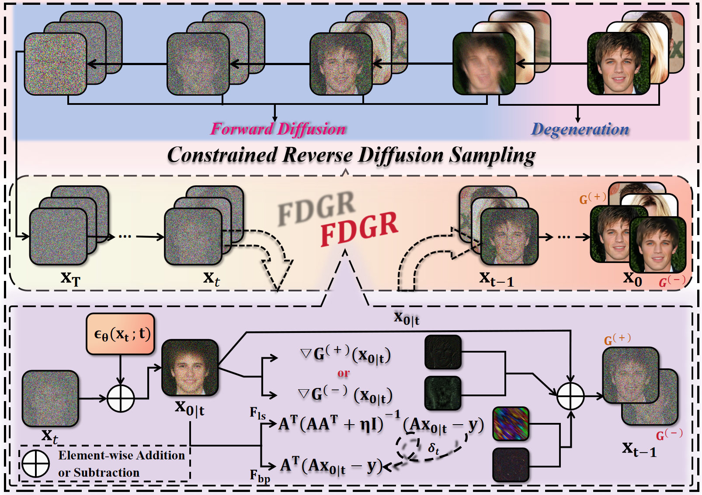
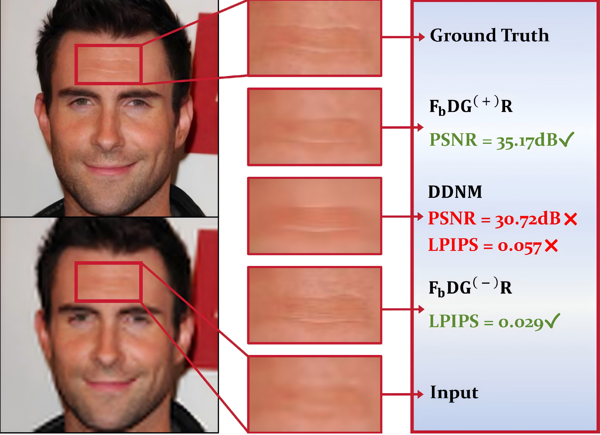
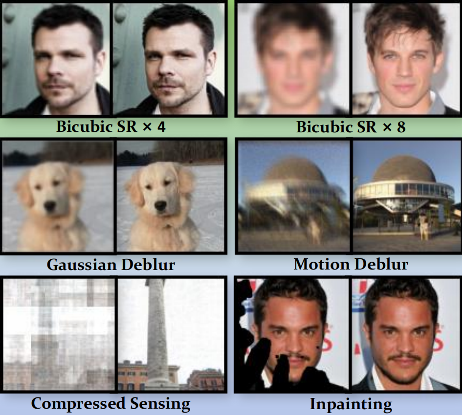

# [ FDGR ] Image Restoration via Optimizing Fidelity with Diffusion and Gradient Regularization

    

---

## 📌 Abstract

Denoising diffusion models have achieved remarkable success in various image restoration tasks. However, most existing approaches rely solely on diffusion priors, which inherently limit their representational capacity and restoration performance. To address this limitation, we propose a novel image restoration method, which optimizes the fidelity with the diffusion and gradient regularization (FDGR). FDGR establishes a zero-shot, parameterized restoration framework by integrating the complementary strengths of diffusion priors and gradient priors. Specifically, by introducing a non-convex gradient regularization term, it effectively suppresses artifacts and preserves structural edges in noise-interfered environments, thereby enhancing overall image fidelity. Meanwhile, we extend this regularization term to the frequency domain to strengthen global texture capture and improve perceptual naturalness. The core of FDGR addresses the trade-off between structural fidelity and perceptual naturalness through a multi-mode restoration scheme that optimizes these objectives separately. Based on the proposed framework, we propose a novel plug-and-play sampling method that adapts to multi-scenario restoration tasks via parameterized adjustments without model retraining. Extensive qualitative and quantitative experiments on popular datasets show that our method achieves superior 
results on both distortion-based and perception-based quality metrics. The ablation studies validate the efficacy of the proposed method.

---

## 🎇 Architecture of FDGR



---

## 💡 Key Features

+ We propose a novel image restoration method, which optimizes fidelity with the diffusion and gradient regularization (FDGR). Besides the diffusion priors, FDGR further incorporates the gradient prior and extends it into the frequency domain for better fidelity and perception.% which enhances global texture capture capability and improves visual perception.
+ Based on this model, we propose an efficient plug-and-play sampling method that allows flexible adaptation to various restoration tasks without retraining the model, thus enabling applications in diverse degradation scenarios.
+ We propose a parameterized image restoration framework that integrates the advantages of diffusion priors and gradient priors, which achieves independent optimization of structural fidelity and perceptual naturalness. Through a dual-mode restoration mechanism, it enables adaptive adjustments for different degradation types to meet specific task demands in practice.
+ Quantitative experimental results on popular datasets demonstrate that our method surpasses existing benchmarks on both distortion-based and perception-based quality metrics. Qualitative analysis shows that the restored images excel in artifact reduction and perceptual quality, thus validating the superiority of the (FDGR) framework.

---

## 🛠 Code Usage && Data Preparation

### Installation
To clone this repository and the code, run:
```
git@github.com:JiaqiZhang-Sengoku/D4PGR.git
```

### Environment
```
pip install torch torchvision lpips numpy tqdm pillow pyYaml pandas scipy
```
```
pip install torch==1.9.0+cu111 torchvision==0.10.1+cu111 -f https://download.pytorch.org/whl/torch_stable.html
```
### Pre-Trained Models 
To download the models used in the paper:

**CelebA-HQ**

The CelebA-HQ model checkpoint can befound [here](https://drive.google.com/file/d/1wSoA5fm_d6JBZk4RZ1SzWLMgev4WqH21/view?usp=share_link).

```
https://drive.google.com/file/d/1wSoA5fm_d6JBZk4RZ1SzWLMgev4WqH21/view?usp=share_link
```

**ImageNet**

The ImageNet model checkpoint can be found [here](https://openaipublic.blob.core.windows.net/diffusion/jul-2021/256x256_diffusion_uncond.pt).

```
wget https://openaipublic.blob.core.windows.net/diffusion/jul-2021/256x256_diffusion_uncond.pt
```

### Datasets

The datasets used in the paper are CelebA-HQ and ImageNet. Both can be found in: 
[[Google drive](https://drive.google.com/drive/folders/1cSCTaBtnL7OIKXT4SVME88Vtk4uDd_u4?usp=sharing)] [[Baidu drive](https://pan.baidu.com/s/1tQaWBqIhE671v3rrB-Z2mQ?pwd=twq0)].

After you download the datasets, place each dataset in the relevant directory:

1. CelebA-HQ - Place the dataset in `FDGR/exp/datasets/celeba/`.
2. ImageNet -  Place the dataset in `FDGR/exp/datasets/imagenet/`.
   
   (1). Download the file `imagenet_val_1k.txt` from the links above as well, and place it in `FDGR/exp`. Rename this file to `imagenet_val.txt` in order for the code to use it.

### Motion Deblur

For motion deblur we used the following git repository to generate the
kernels: https://github.com/LeviBorodenko/motionblur.

Clone that repository and copy the *motionblur.py* file into `FDGR/functions`.

As mentioned in the paper, we used motion deblur kernels with `intensity=0.5`.

---

## 🧩 Parameters

The general python command to run the code is:
```
python main.py --config {config}.yml --path_y {dataset_folder} --deg {deg} --sigma_y {sigma_y}
-i {image_folder} --inject_noise {inject_noise} --gamma {gamma} --zeta {zeta} --eta_tilde {eta_tilde}
--step_size_mode {step_size_mode} --operator_imp {operator_implementation} --save_y {save_observation}
--scale_ls {scale_for_gLS} --mode {G- or G+} --lam {lam} --alpha {alpha} --sigma_g {sigma_g}
```

### Quick Start
```
python main.py --config celeba_hq.yml --path_y celeba_hq --deg sr_bicubic --sigma_y 0.05 -i FDG+R/Celeba_4SR_0.05
--inject_noise 0 --gamma 16 --eta_tilde 0.2 --step_size_mode 0 --deg_scale 4 --operator_imp SVD --mode G+
--lam 1.3 --alpha 0.2 --sigma_g 0.8
```

### Eval
To evaluate PSNR, LPIPS, SSIM and FID metrics, use the following command:
```
python eval.py [path your results]
```

---

## 💪 Qualitative Results and Comparison






Additional results can be found in the paper, including PSNR, LPIPS, SSIM and FID results compared to competitors.

---

## 😊 Acknowledgements

Our implementation is built upon [DDRM](https://github.com/bahjat-kawar/ddrm), [DDNM](https://github.com/wyhuai/DDNM), and [DDGR](https://github.com/tirer-lab/DDPG). We thank the authors for their excellent work.

We sincerely thank everyone for their tremendous contributions to this project, and extend our gratitude to the editors and reviewers for their dedicated work!

